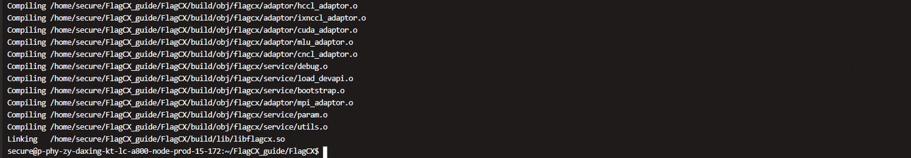
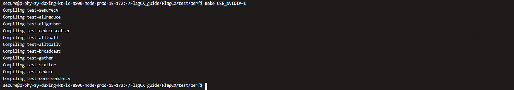

## Environment Setup

**Reference Command for Container Creation:** Modify the `<Docker name> <mount directory> <mount point>` and choose the `<Docker Image>` as needed.

```Plain
-------------Reference Command for Container Creation on NVIDIA A800 Platform------------
sudo docker run -itd \
                --name <Docker name> \
                --privileged \
                --net=host \
                --pid=host \
                --cap-add=ALL \
                --shm-size 128G \
                --ulimit memlock=-1 \
                --gpus all \
                -v /dev/:/dev/ \
                -v /usr/src/:/usr/src/ \
                -v /lib/modules/:/lib/modules/ \
                -v <mount directory>:<mount point> \
                <Docker Image> \
                /bin/bash
-------------Reference Command for Container Creation on Kunlunxin P800 Platform-----------
sudo docker run -itd \
        --name <Docker name> \
        --privileged \
        --net=host \
        --pid=host \
        --shm-size 128G \
        --ulimit memlock=-1 \
        --group-add video \
        -v <mount directory>:<mount point> \
        -v /usr/local/xpu/:/usr/local/xpu \
        <Docker Image> \
        /bin/bash  
```

​            

## Build and Installation

1. Obtain FlagCX Source Code and Build Installation

   Review and Choose Build Options Suitable for the Current Platform

   ```
   git clone https://github.com/flagos-ai/FlagCX.git
   cd FlagCX 
   git submodule update --init --recursive
   cat Makefile
   make USE_NVIDIA=1 -j$(nproc) # NVIDIA GPU Platform
   make USE_CAMBRICON=1 -j$(nproc)  # Cambricon Platform
   make USE_KUNLUNXIN=1 -j$(nproc) # Kunlunxin Platform
   ```
   
2. Successful Build Result

   

3. Potential Issues During Compilation

   - **If** **`nccl.h`** **or other libraries are not found** 

      - You can first use `locate xxx.h` to find the local path of the header file.

      - Once found, you can directly set `CCL_HOME=XXX` to specify the installation path. The build system will automatically use `$CCL_HOME/include` and `$CCL_HOME/lib` for header and library paths.

      - If the file is not present locally, install the corresponding header/library. There are multiple installation methods; one example is provided below.

        ```Plain
        sudo apt-key adv --keyserver keyserver.ubuntu.com --recv-keys A4B469963BF863CC  #Import the public key
        echo "deb https://developer.download.nvidia.com/compute/cuda/repos/ubuntu2004/x86_64/ /" | sudo tee /etc/apt/sources.list.d/cuda.list                                # Add repository
        sudo apt-get update                                              # Update apt
        sudo apt-get install libnccl-dev                                 # Install NCCL development package
        sudo apt-get install cuda-toolkit-11-8                           # Install CUDA Toolkit
        ```


   - If `gtest.h` header file error occurs

      Install Google Test (gtest) unit testing framework

      ```Plain
      git clone https://github.com/google/googletest.git # Obtain gtest source code
      cd googletest                                      # Enter the project directory
      mkdir build                                        # Create a directory to store build output
      cd build                                           # Enter the build directory
      cmake ..                                           # Generate native build scripts for GoogleTest
      make                                               # Compile the source
      sudo make install                                  # Install the static libraries
      ```


## Homogeneous Testing with FlagCX

## Communication API Test

1. Environment Setup

   Select the Docker image `<Docker Image>` to create a container and enter it.

2. Select Build Options

   ```Plain
   cd FlagCX/test/perf # Enter the test directory
   make USE_NVIDIA=1 # Compile with options based on the hardware platform
   ```

3. Successful Build Result

   

## Torch API Test

1. Environment Setup

   - Select the Docker image `<Docker Image>` to create a container and enter it.
   
   
      - Check whether PyTorch is installed in the container. If not, install it using the procedure below.
   
        ```Plain
        pip list | grep torch         # Check if PyTorch is installed in the container
        ------------------# Install PyTorch----------------------------------
        python -m pip install --pre torch \
          --index-url https://download.pytorch.org/whl/nightly/<cuXXX> \
          --trusted-host download.pytorch.org \
          --no-cache-dir --timeout 300 \
          --root-user-action=ignore
          
        nvcc --version 2>/dev/null || nvidia-smi   # Check the CUDA runtime driver version; if release is 12.4, install the corresponding cu124 version
        ```
   
         **Note:** `<cuXXX>` corresponds to the version of the CUDA toolkit matching your current hardware driver.
   


2. Select Build Options

   ```
   cd /FlagCX/plugin/torch/
   FLAGCX_ADAPTOR=[xxx] pip install -e . --no-build-isolation
   ```

   **Note**: `[xxx]` should be selected according to the current platform, e.g., `nvidia`, `klx`, etc.

3. Successful Build Result

   - After compilation, a `build` directory will be generated.Run the command:

     ```
     pip list | grep flagcx
     ```

   - You should see the `flagcx` version and path matching the current build directory, indicating that the compilation and installation were successful.

     ```
     python -c "import flagcx; print(flagcx)"
     ```


## Homogeneous Training with FlagCX + FlagScale

1. Environment Setup

   - Select the Docker image `<Docker Image>`, create a container named `<Docker name>`, and enter the container.

     ```Plain
     ## Check conda environments
     conda env list  
     ## Activate the flagscale-train environment for subsequent operations
     conda activate flagscale-train 
     pip install modelscope 
     pip install pandas
     ```
     
     **Note:** if there is no conda env called "flagscale-train", we may need to set up the conda env by running
     
     ```Plain
     ./install/install-requirements.sh --env train
     ```
     
   
   - Training Backend Code Adaptation for Unpatched Mode
   
     ```Plain
     cd FlagScale
     python tools/patch/unpatch.py --backend Megatron-LM
     ```


2. Build and Install the FlagCX Library

   - Pull the FlagScale and FlagCX source code.

     ```Plain
     git clone https://github.com/flagos-ai/FlagScale.git 
     git clone https://github.com/flagos-ai/FlagCX.git
     ```
   
   
      - Build and Install FlagCX
   
        ```Plain
        cd FlagCX                        # Enter the FlagCX directory; check the Makefile to select build options based on your platform, e.g., USE_NVIDIA, USE_KUNLUNXIN, etc.
        make USE_NVIDIA=1                # Compile FlagCX with NVIDIA GPU support
        cd plugin/torch                  # Enter the Torch plugin directory
        python setup.py develop --adaptor nvidia   # Install the Python Torch adaptor in development mode
        pip list | grep flagcx           # Verify the installation and check the absolute path of the installed FlagCX package
        ```
   
   
      - Screenshot of Successful Compilation and Installation
   
        ```
        python -c "import flagcx; print(flagcx)"
        ```
   


## Heterogeneous Testing with FlagCX

## Communication API Test

1. Environment Setup

   Select the Docker image `<Docker Image>` to create a container and enter it.


2. Create a symbolic link

   ```
   cd /root
   ln -s /workspace/flagcx_test_[xxx]/FlagCX ./FlagCX
   ```

   **Explanation**

   - `/workspace/` — Shared folder; after mounting in the containers, both host1 and host2 can access it.
   - `flagcx_test_[xxx]/FlagCX` — `[xxx]` indicates the FlagCX communication library for different platforms.
   - `./FlagCX` — Symbolic link name; by accessing `/root/FlagCX`, you can reach the FlagCX library for the current platform.

3. Build and Install

   - On each host, compile and install the FlagCX communication API separately.

   - Refer to the section **“Homogeneous Testing with FlagCX”** for detailed steps.
