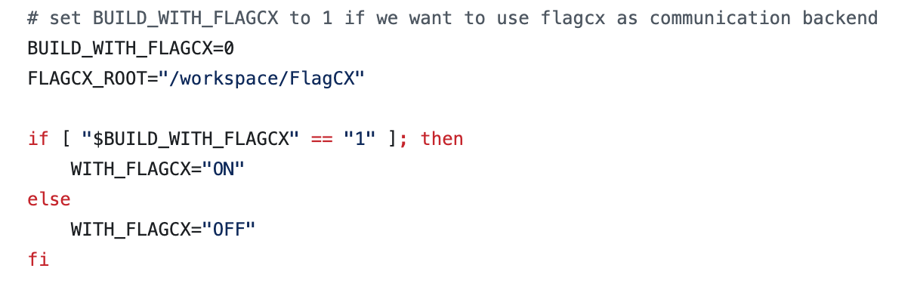
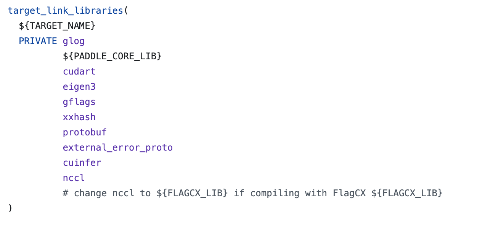

# Guide For Using Paddle With FlagCX On Iluvatar Machines
## Environment Setup
1. prepare a docker container on Iluvatar machines
2. start the docker container
    ```bash
    sudo docker exec -it [container_name] bash
    ```
3. clone PaddleCustomDevice
    ```bash
    git clone https://github.com/PaddlePaddle/PaddleCustomDevice.git
    ```
4. clone FlagCX
    ```bash
    git clone https://github.com/FlagOpen/FlagCX.git
    ```
## Compile Paddle With FlagCX
1. cd into iluvatar_gpu directory
    ```bash
    cd PaddleCustomDevice/backends/iluvatar_gpu
    ```
2. modify default build script to enable compiling with FlagCX  
    - In `build_paddle.sh`
        
        set `BUILD_WITH_FLAGCX=1` and the correct location for `FLAGCX_ROOT`
    - In `CMakeLists.txt`
        
        change `nccl` to `${FLAGCX_LIB}`
3. run build script
    ```bash
    bash build_paddle.sh
    ```
4. run install script
    ```bash
    bash install_paddle.sh
    ```
__Note__: To build Paddle with FlagCX on Iluvatar machines, we need to ensure that FlagCX is built before building Paddle

## Train Model using Paddle + FlagCX
We now support training ERNIE4.5 on Iluvatar machines using Paddle + FlagCX. Please refer to the following steps to get started
1. Get ERNIE-4.5-Lite model from huggingface   
    ERNIE-4.5-Lite corresponds to ERNIE-4.5-21B-A3B-Paddle 
2. clone ERNIE repo
    ```bash
    git clone https://github.com/PaddlePaddle/ERNIE.git
    ```
3. install dependencies
    ```bash
    cd ERNIE
    pip install -r requirements/gpu/requirements.txt
    ```
4. create a training script; please refer to the training script below
    ```bash
    #!/bin/bash
    # Copyright (c) 2025 PaddlePaddle Authors. All Rights Reserved.
    #
    # Licensed under the Apache License, Version 2.0 (the "License");
    # you may not use this file except in compliance with the License.
    # You may obtain a copy of the License at
    #
    #     http://www.apache.org/licenses/LICENSE-2.0
    #
    # Unless required by applicable law or agreed to in writing, software
    # distributed under the License is distributed on an "AS IS" BASIS,
    # WITHOUT WARRANTIES OR CONDITIONS OF ANY KIND, either express or implied.
    # See the License for the specific language governing permissions and
    # limitations under the License.

    unset PADDLE_TRAINERS_NUM
    unset PADDLE_ELASTIC_JOB_ID
    unset PADDLE_TRAINER_ENDPOINTS
    unset DISTRIBUTED_TRAINER_ENDPOINTS
    unset FLAGS_START_PORT
    unset PADDLE_ELASTIC_TIMEOUT
    export PADDLE_DISTRI_BACKEND=xccl
    export PADDLE_XCCL_BACKEND=iluvatar_gpu
    export PYTHONPATH=$(dirname "$0")/../../../..:$PYTHONPATH
    export FLAGS_set_to_1d=False
    export NVIDIA_TF32_OVERRIDE=0
    export FLAGS_dataloader_use_file_descriptor=False
    export FLAGCX_SOCKET_IFNAME=ens22f0,ens11f0np0
    export FLAGCX_IB_HCA=mlx5_101
    export FLAGCX_DEBUG=TRACE
    export FLAGCX_DEBUG_SUBSYS=INIT
    export FLAGCX_ENABLE_TOPO_DETECT=TRUE
    #export GLOG_v=4
    #export FLAGS_call_stack_level=3
    #export LD_PRELOAD=/usr/local/corex-4.3.0/lib64/libcuda.so.1

    model_path="/workspace/ernie/ERNIE-4.5-Lite"
    #model_path="/workspace/ernie/ERNIE-4.5-21B-A3B-Paddle"
    task="sft_8k"
    paddle_log_dir="${model_path}/${task}_log"
    vdl_log_dir="${model_path}/${task}_vdl"
    output_dir="${model_path}/${task}_checkpoint"

    rm -rf ${paddle_log_dir}

    python3 -m paddle.distributed.launch \
        --log_dir ${paddle_log_dir} \
        --gpus 0,1,2,3,4,5,6,7,8,9,10,11,12,13,14,15 \
        ../../../../examples/post-training/sft/train.py \
        --logging_dir ${vdl_log_dir} \
        --model_name_or_path ${model_path} \
        --output_dir ${output_dir} \
        --per_device_train_batch_size 1 \
        --per_device_eval_batch_size 1 \
        --train_dataset_path "/workspace/ernie/ERNIEKit-tianshu-new/examples/data/sft-train.jsonl" \
        --train_dataset_prob "0.8" \
        --train_dataset_type "erniekit" \
        --eval_dataset_path "/workspace/ernie/ERNIEKit-tianshu-new/examples/data/sft-eval.jsonl" \
        --train_dataset_prob "0.2" \
        --train_dataset_type "erniekit" \
        --max_steps 100 \
        --max_evaluate_steps 10000 \
        --num_train_epochs 1 \
        --save_steps 500 \
        --logging_steps 1 \
        --eval_steps 500 \
        --weight_decay 0.01 \
        --do_train \
        --evaluation_strategy steps \
        --tensor_parallel_degree 4 \
        --pipeline_parallel_degree 4 \
        --sharding_parallel_degree 1 \
        --sharding stage1 \
        --max_seq_len 8192 \
        --seed 23 \
        --gradient_accumulation_steps 2 \
        --warmup_steps 20 \
        --lr_scheduler_type "linear" \
        --learning_rate 3e-4 \
        --num_samples_each_epoch 6000000 \
        --bf16 \
        --fp16_opt_level O2 \
        --amp_custom_white_list "lookup_table" "lookup_table_v2" "flash_attn" "matmul" "matmul_v2" "fused_gemm_epilogue" \
        --amp_custom_black_list "reduce_sum" "softmax_with_cross_entropy" "c_softmax_with_cross_entropy" "elementwise_div" "sin" "cos" \
        --disable_tqdm True \
        --recompute 0 \
        --offload_optim 0 \
        --recompute_granularity "full" \
        --dataloader_num_workers 1 \
        --distributed_dataloader 1 \
        --use_flash_attention 1 \
        --use_sparse_head_and_loss_fn 0 \
        --use_attn_mask_start_row_indices 0 \
        --use_sparse_flash_attn 0 \
        --tensor_parallel_output 0 \
        --pipeline_parallel_config "disable_partial_send_recv enable_clear_every_step_cache disable_batch_p2p_comm" \
        --greedy_intokens 1 \
        --lr_scheduler linear \
        --sequence_parallel 1 \
        --release_grads 1 \
        --recompute_use_reentrant True \
        --fuse_rope 1 \
        --device iluvatar_gpu \
        --continue_training False \
        --moe_group "mp" \
        --lora \
        --lora_rank 32 \
        --moe_multimodal_dispatch_use_allgather "" \
        --unified_checkpoint_config "async_save"
    ```


