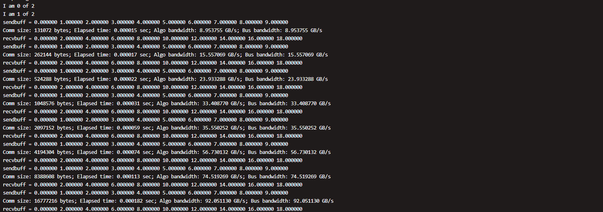
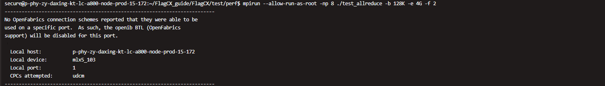
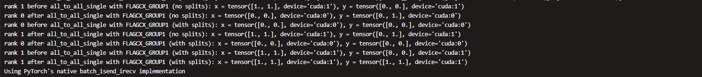
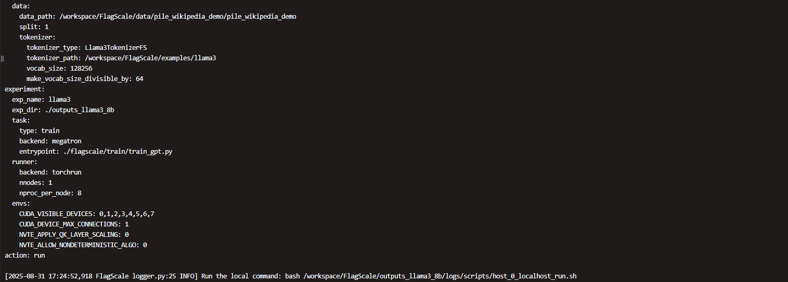
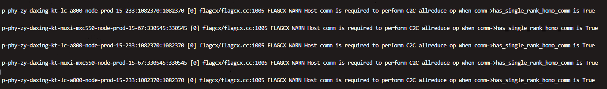

## Environment Configuration

Refer to the environment setup section in the [getting started](getting_started.md) page.

## Installation and Compilation

Refer to [getting started](getting_started.md) for FlagCX compilation and installation.

## Homogeneous Tests Using FlagCX

### Communication API Test

1. Build and Installation

   Refer to the Communication API test build and installation section in [getting_started.md](getting_started.md).

1. Communication API Test

   ```shell
   mpirun --allow-run-as-root -np 2 ./test_allreduce -b 128K -e 4G -f 2 -p 1
   ```

   **Description**

   -  `test_allreduce` is a performance benchmark for AllReduce operations built on MPI and FlagCX.
      Each MPI process is bound to a single GPU.
      The program runs warm-up iterations followed by timed measurements across a user-defined range of
      message sizes (minimum, maximum, and step).

   -  For every message size, the benchmark reports:
     - Average latency
     - Estimated bandwidth
     - Buffer fragments for correctness verification

   For example, running `test_allreduce` with 2 MPI processes on 2 GPUs starts from 128 KiB and
   doubles the message size each step (128 KiB, 256 KiB, 512 KiB, 1 MiB …) up to 4 GiB.
   For each size, the benchmark records bandwidth, latency, and correctness results.

1. Correct Performance Test Output

   

1. Issues Encountered During Execution

   - During execution, you may see an assertion warning when OpenMPI attempts to establish a connection
     via InfiniBand (openib BTL) but cannot find an available CPC (Connection Protocol).
     In this case, the IB port is disabled automatically.This warning does not affect the performance test results.

     

     **Solution**

     To suppress this warning, disable `openib` and fall back to TCP by adding the following option
     to your `mpirun` command.

     ```shell
     --mca btl ^openib
     ```

   - **MPI Error Warning**

     If you encounter an MPI error during execution, there are two possible solutions:

     **Check Local MPI Installation**

     - Verify your local MPI installation path and set the appropriate environment variables.

     **Install MPI**

     - If MPI is not installed or the local installation is not suitable, download and install MPI.

     - Follow the instructions below:

       ```Plain
       wget https://download.open-mpi.org/release/open-mpi/v4.1/openmpi-4.1.6.tar.gz  
       tar -zxf openmpi-4.1.6.tar.gz  
       cd openmpi-4.1.6  
       ##Configure and Build 
       ./configure --prefix=/usr/local/mpi make -j$(nproc) sudo make install
       ```

### Torch API Test

1. Build and installation

   Refer to [getting started](getting_started.md) for instructions on building and installing the Torch API test.

1. Torch API test execution

   The test case is located in the build/installation directory.

   ```shell
   cd ./example/example.py
   ```

   The test script `run.sh` sets environment variables and device IDs according to the current platform.
   You may need to modify these variables to match your hardware setup.

   ```bash
   #!/bin/bash

   # Check if the debug flag is set
   if [ "$1" == "debug" ]; then
       export NCCL_DEBUG=INFO
       export NCCL_DEBUG_SUBSYS=all
       echo "NCCL debug information enabled."
   else
       unset NCCL_DEBUG
       unset NCCL_DEBUG_SUBSYS
       echo "NCCL debug information disabled."
   fi
   
   export FLAGCX_IB_HCA=mlx5
   export FLAGCX_ENABLE_TOPO_DETECT=TRUE
   export FLAGCX_DEBUG=TRUE
   export FLAGCX_DEBUG_SUBSYS=ALL
   export CUDA_VISIBLE_DEVICES=0,1
   # Need to preload customized gloo library specified for FlagCX linkage
   # export LD_PRELOAD=/usr/local/lib/libgloo.so
   # export LD_PRELOAD=/usr/local/nccl/build/lib/libnccl.so
   export TORCH_DISTRIBUTED_DETAIL=DEBUG
   CMD='torchrun --nproc_per_node 2 --nnodes=1 --node_rank=0 --master_addr="localhost" --master_port=8281 example.py'
   
   echo $CMD
   eval $CMD
   ```

   The arguments for `torchrun` are as follows:

   - `nproc_per_node`: Number of processes to launch on the current machine.
   - `nnodes`: Total number of nodes participating in the training.
     For homogeneous mode testing, set this to 1.
   - `node_rank`: The rank of the current node among all nodes, starting from 0.
     For homogeneous mode testing, set this to 0.
   - `master_addr`: Address (hostname or IP) of the master node.
     For homogeneous mode testing, set this to `"localhost"` is okay.
     For heterogeneous mode testing, specify the reachable IP or hostname of the master node.
     It is assumed that the address is reachable from all nodes.
   - `master_port`: Port used by the master node to establish the process group.
     All nodes must use the same port, and the port has to be available on all nodes.
   - `example.py`: Torch API test script.
   - Refer to [enviroment variables](enviroment_variables.md) for the usage of the various `FLAGCX_XXX` environment variables.

3. Sample screenshot from a correct performance test

   


## Homogeneous Training with FlagCX + FlagScale

The following steps shows an example in which we run the LLaMA3-8B model on Nvidia A800 GPUs.

1. Build and installation

   Refer to the Environment Setup and Build & Installation section in the [getting started](./getting_started.md) page.

1. Data preparation

   ```
   cd FlagScale
   mkdir data
   ```

   A small portion of processed data from the Pile dataset (bin and idx files) is provided: `pile_wikipedia_demo`.
   Copy it to the `FlagScale/data` directory.

1. Model configuration 1

   ```
   cd FlagScale/examples/llama3/conf/ 
   vi train.yaml
   ```

   The directory contains the following files:

   - `train/` — Training scripts and related files.

   - `train.yaml` — Configuration file for **homogeneous training**

     The `train.yaml` file contains four main sections: `defaults`, `experiment`, `action`, and `hydra`.
     For most cases, you only need to modify the `defaults` and `experiment` sections.

     - Modify `defaults`

       ```yaml
       train: XXXX
       ```

        Replace `XXXX` with `8b`.

     - Modify `experiment`

       ```yaml
       exp_dir: ./outputs_llama3_8b
       ```

       This specifies the output directory for distributed training results.

     - Modify `runner` settings under `experiment`

       * **hostfile**: For a homogeneous (single-node) mode test, comment out the `hostfile` line.
         Only configure it for heterogeneous (multi-node) mode setups.

       * **envs**: Set GPU device IDs using `CUDA_VISIBLE_DEVICES`, for example:

         ```yaml
         CUDA_VISIBLE_DEVICES: 0,1,2,3,4,5,6,7
         ```

   - `train_hetero.yaml` — Configuration file for **heterogeneous training**

1. Model Configuration 2

   The model configuration files (`xxx.yaml`) corresponding to different dataset sizes
   are located in the `examples` directory.

   ```shell
   cd FlagScale/examples/llama3/conf/train 
   vi 8b.yaml 
   ```

   - **`8b.yaml`** **Configuration File**

       The `8b.yaml` file contains three main sections: system, model, and data.

       **System Section**

       Add the following line to enable distributed training with FlagCX:

       ```Plain
       distributed_backend: flagcx
       ```

       **Model Section**

       Configure the training parameters.Use `train_samples` and `global_batch_size` to determine the number of steps:

       ```Plain
       step = train_samples / global_batch_size
       ```

         It is recommended to set it as an integer.

       **Data Section**

       Modify the following parameters:

       - **data_path**: Set this to the `cache` directory under the data prepared in the previous step.

       - **tokenizer_path**: Download the tokenizer from the official website corresponding to your model and set the path here.

1. Download tokenizer


   Download the tokenizer corresponding to the model.
   The files are available at: [Meta-LLaMA-3-8B-Instruct Tokenizer](https://www.modelscope.cn/models/LLM-Research/Meta-Llama-3-8B-Instruct/files?utm_source=chatgpt.com).


   It is recommended to download the tokenizer via the command line.
   Place the downloaded tokenizer files in the path specified by `tokenizer_path` in your configuration (`8b.yaml`).

   For example:

   ```shell
   cd FlagScale/examples/llama3
   modelscope download --model LLM-Research/Meta-Llama-3-8B-Instruct [XXXX] --local_dir ./
   ```

   The `[XXXX]` in the above command refers to the tokenizer files corresponding to Meta-LLaMA-3-8B-Instruct.
   The content could be, for example:

   - `tokenizer.json`
   - `tokenizer_config.json`
   - `config.json`
   - `configuration.json`
   - `generation_config.json`

   These files should be placed in the directory specified by `tokenizer_path` in your configuration (`8b.yaml`).

1. Distributed training

   To start a distributed training:

   ```shell
   cd FlagScale
   python run.py --config-path ./examples/llama3/conf --config-name train action=run 
   ```

   To stop the training:
   ```shell
   python run.py --config-path ./examples/llama3/conf --config-name train action=stop 
   ```

   After starting distributed training, the configuration information will be printed,
   and a run script will be generated at:

   ```Plain
   flagscale/outputs_llama3_8b/logs/scripts/host_0_localhost_run.sh
   ```

   The training output files can be found under `flagscale/outputs_llama3_8b`.

   **Notes:**

   - You can inspect the run script to verify the commands and environment settings used for the training.

   - All logs and model checkpoints will be saved under the output directory.

     

## Heterogeneous Tests Using FlagCX

### Communication API Test

1. Build and Installation

   Refer to the [getting started](./getting_started.md) documentation for instructions on
   environment setup, creating symbolic links, and how to build and install the software.

1. Verify MPICH Installation

   To check if MPICH has been installed:

   ```shell
   cd /workspace/mpich-4.2.3
   ```

1. Makefile and environment variable configuration

   ```
   # Navigate to the Communication API test directory
   cd /root/FlagCX/test/perf 
   
   # Open the Makefile
   vi Makefile
       # Modify the MPI path to match the one used in step 2
       MPI_HOME ?= /workspace/mpich-4.2.3/build/ 
   :q # Save and exit
   
   # Configure environment variables
   export LD_LIBRARY_PATH=/workspace/mpich-4.2.3/build/lib:$LD_LIBRARY_PATH
   ```

1. Heterogeneous Communication API Test

   - Ensure that Host 1, Host 2, … are all configured as described above and
     can correctly run the homogeneous Communication API test on their respective platforms.

   - Verify that the ports on Host 1, Host 2, … are `<xxx>` and keep them consistent across all hosts.

   - Before running the heterogeneous Communication API test script on Host 1,
     configure the port number environment variable:

     ```shell
     export HYDRA_LAUNCHER_EXTRA_ARGS="-p 8010"
     ```
     
     Here, `8010` should match the configuration set during SSH passwordless login.

   - Run the heterogeneous Communication API test script on Host 1:

     ```shell
     ./run.sh
     ```

     ```shell
     /workspace/mpich-4.2.3/build/bin/mpirun \
       -np 2 -hosts 10.1.15.233:1,10.1.15.67:1 \
       -env PATH=/workspace/mpich-4.2.3/build/bin \
       -env LD_LIBRARY_PATH=/workspace/mpich-4.2.3/build/lib:/root/FlagCX/build/lib:/usr/local/mpi/lib/:/opt/maca/ompi/lib \
       -env FLAGCX_IB_HCA=mlx5 \
       -env FLAGCX_ENABLE_TOPO_DETECT=TRUE \
       -env FLAGCX_DEBUG=INFO \
       -env FLAGCX_DEBUG_SUBSYS=INIT \
       /root/FlagCX/test/perf/test_allreduce -b 128K -e 4G -f 2 -w 5 -n 100 -p 1`
     ```

     - Refer to [enviroment_variables.md](enviroment_variables.md) for the meaning and usage of `FLAGCX_XXX` environment variables.


   - **Note:** When using two GPUs per node in the heterogeneous Communication API test, some warnings may indicate that each node only has 1 GPU active. In this case, FlagCX will skip GPU-to-GPU AllReduce and fall back to host-based communication.

     - As a result, GPU utilization may show 0%, and the overall AllReduce runtime may be much longer.
     
     - However, the computation results are correct, and this behavior is expected.

     - To fully utilize GPU acceleration for heterogeneous testing, use 2+2 GPUs (4 GPUs total) across the nodes.
     
       
